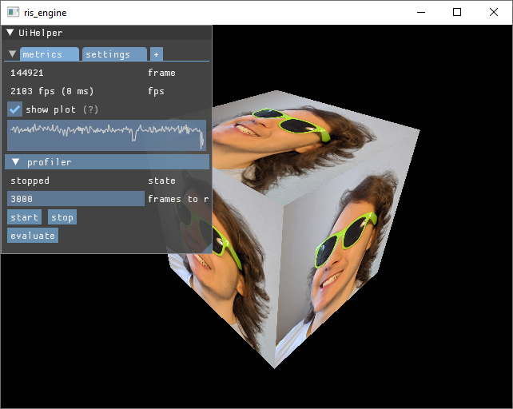

# ris_engine

Barebones game engine. Home made passion project.



## Features:

- [x] Startup, shutdown, mainloop and error handling
- [x] Logging, to console and file
- [x] Threadpool based concurrency
- [x] Remappable controls
  - [x] Mouse
  - [x] Keyboard
  - [x] Gamepad
- [x] 3d math
  - [x] Vectors and Matrices
  - [x] Quaternions
  - [x] Color
    - [x] RGB
    - [x] OkLab
- [x] 3d Graphics via Vulkan
  - [ ] Terrain
  - [x] Static Meshes
  - [ ] Skinned Meshes
  - [ ] Materials
  - [ ] Lighting
- [x] Debugging
  - [x] GUI via Dear ImGui
  - [x] Profiling
  - [x] 3d Gizmos
  - [x] const hashed string ids
- [x] Asset system and pipeline
  - [x] Importing
  - [x] Loading
  - [x] (De)compiling
- [x] Codecs
  - [x] GLSL to SpirV, with custom pre processor
  - [x] QOI
  - [x] glTF
- [x] Settings/Configuration
- [x] Gameobjects and components
  - [x] Mesh renderer
  - [x] Scripting
- [x] Scene editing, saving and loading
- [ ] Collisions
- [ ] Animations
  - [ ] Bones
- [ ] 3d Sound

**Legend**:
- [x] implemented
- [ ] planned

## Requirements

You will need rustc and cargo to compile this repo. I am using version 1.90.0 [download link](https://www.rust-lang.org/tools/install)

The target platform is x86_64, Windows and Linux.

_A newer compiler and other platforms may work, but I cannot give guarantees._

Your hardware must support [Vulkan](https://www.vulkan.org/). Most modern GPUs work.

You also require an internet connection, to download dependencies from [crates.io](https://crates.io/). You can [vendor](https://doc.rust-lang.org/cargo/commands/cargo-vendor.html) crates for offline use or download an archived repo from [my website](https://www.rismosch.com/archive). Note that I make these archives sporadically, meaning they may not be up to date.


## Setup

This engine relies on the [Vulkan SDK](https://vulkan.lunarg.com/). ris_engine requires prebuild binaries from it.

For information on how to get and install the Vulkan SDK, click to reveal the instructions for the given platform.

### Windows

<details>
  <summary>click to reveal</summary>

  Download and run the SDK Installer from https://vulkan.lunarg.com/sdk/home#windows

  When running the SDK Installer, make sure that you select the SDL2 libraries and headers.

  To confirm if the Vulkan SDK was installed properly, check the environment variables `$VULKAN_SDK` and `$VK_SDK_PATH`. They should be pointing to the directory where you installed the SDK into. You can also confirm if your hardware supports Vulkan, by running `$VULKAN_SDK/Bin/vkcube.exe`. If you see a spinning cube with the LunarG logo, everything is working as intended.
</details>

### Arch Linux

<details>
  <summary>click to reveal</summary>
  
  #### 1. Install [SDL2](https://archlinux.org/packages/extra/x86_64/sdl2/)
  
  ```bash
  sudo pacman -S sdl2
  ```
  
  #### 2. Install [shaderc](https://archlinux.org/packages/extra/x86_64/shaderc/)
  
  ```bash
  sudo pacman -S shaderc
  ```
  
  #### 3. Install [Vulkan](https://wiki.archlinux.org/title/Vulkan)
  
  Depending on your graphics card, you need to install a different package. Follow the instructions in the link below:
  
  https://wiki.archlinux.org/title/Vulkan#Installation
</details>

## Building

Assuming your environment is set up properly, you can now compile and run the engine with:

```bash
cargo run
```

Alternatively, you can build a release-ready package, by running the command below. Note that this builds with all optimizations enabled, which may take longer than just using `cargo run`.

```bash
cargo run -- cli build
```

Passing the `-r` flag is discouraged, because asset discovery works differently in release builds. If you want to pass the `-r` flag to cargo, you must import and compile the assets manually. Infos and how to do that can be found in [`./assets/README.md`](./assets/README.md).

## Testing

All tests are found under `./tests/` and can be run with:

```bash
cargo test
```

Alternatively, to run **much** more extensive tests, you can run the command below. Note that this may take several minutes.

```bash
cargo run -- cli pipeline all
```

Using the command above, some tests run [miri](https://github.com/rust-lang/miri). If miri is not installed, then the according tests will fail.

## Cli

The command `cargo run -- cli` is a command line utility tool. It runs features of `ris_engine` as a headless oneshot cli program. Thus it enhances the development environement and provides further utility functions.

For all available commands run:

```bash
cargo run -- cli
```

To get further information on a specific command and what additional args it may be need, run:

```bash
cargo run -- cli help <command>
```

To execute a command, run:

```bash
cargo run -- cli <command> [args...]
```

For example, the command below runs the testing pipeline:

```bash
cargo run -- cli pipeline all
```
