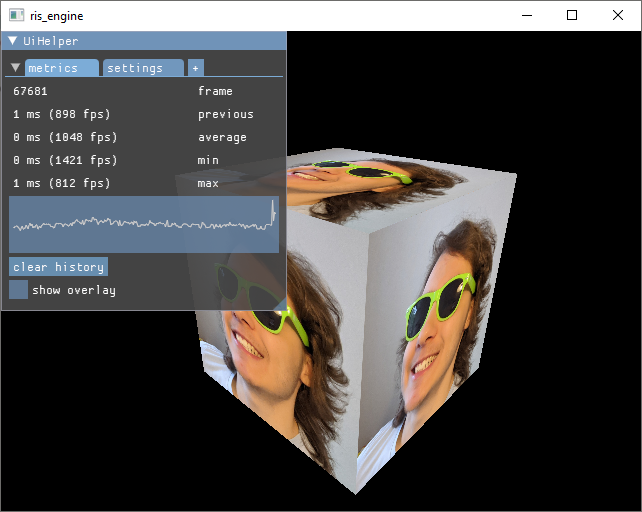

# ris_engine

Barebones game engine. Home made passion project. 

🏗️ **VERY WIP** 👷



## Features:

- [x] Startup, shutdown, mainloop and error handling
- [x] Logging, to console and file
- [x] Threadpool based concurrency
- [x] Remappable controls
  - [x] Mouse
  - [x] Keyboard
  - [x] Gamepad
- [x] 3d math
  - [x] Vectors and Matrices
  - [x] Quaternions
  - [x] Color
    - [x] RGB
    - [x] OkLab
- [x] Basic 3d renderer via Vulkan
- [x] Debug GUI via Dear ImGui
- [ ] Debug gizmos
  - [ ] Point
  - [ ] Line
  - [ ] Box
  - [ ] Sphere
  - [ ] Text
- [x] Asset System
  - [x] Importing (convert raw assets to usable form)
  - [x] Loading (use in engine)
  - [x] (De)compiling
- [x] Codecs
  - [x] GLSL to SpirV, with custom pre processor
  - [x] QOI
- [x] Settings/Configuration
- [ ] Gameobjects

## Requirements

|          |                          | Notes                                                    |
| -------- | ------------------------ | -------------------------------------------------------- |
| Compiler | rustc 1.77.2             | [Download Link](https://www.rust-lang.org/tools/install) |
| Platform | x86_64 Windows and Linux | may or may not compile on other platforms                |
| Graphics | Vulkan capable Hardware  |                                                          |

You also require an internet connection, to download dependencies from [crates.io](https://crates.io/). You can [vendor](https://doc.rust-lang.org/cargo/commands/cargo-vendor.html) crates for offline use or download an archived repo from [my website](https://www.rismosch.com/archive).Note that I make these archives sporadically, meaning they may not be up to date.

## Installation

This engine is using various 3rd party libraries. Trying to build without these will most definitely result in diverse compile, linker and runtime errors. Depending on your platform, follow the instructions below.

### Windows

In this repo you will find the   `./external/` directory. It contains all required libraries. If you don't want to use the binaries in this repo, you can install the Vulkan SDK, which provides binaries for `SDL2` and `shaderc`.

#### 1. Copy _EVERY_ `*.dll` in `./external/bin/` to the root of this repository.

These DLLs need to be available in your environment. So either assign it to your environment variables or move them to the root of the directory.

#### 2. Set the environment variable `SHADERC_LIB_DIR`

[shaderc](https://crates.io/crates/shaderc) requires the DLL `shaderc_shared.dll` during build time. `shaderc` allows to store and compile shader code inside Rust source files. `ris_engine` does not use this feature, but `shaderc` requires this dependency regardless. It searches the DLL in `SHADERC_LIB_DIR`.

For more info, check this link: https://docs.rs/shaderc/0.8.3/shaderc/index.html

So, if `shaderc_shared.dll` sits inside directory `/path/to/shaderc/`, then set `SHADERC_LIB_DIR` to `/path/to/shaderc/`. If you don't want to move the DLL, you can simply set `SHADERC_LIB_DIR` to `<path of this repo>/external/bin/`.

#### 3. Copy _EVERY_ `*.lib` in `./external/lib/` to

```powershell
C:\Users\<your username>\.rustup\toolchains\<current toolchain>\lib\rustlib\<current toolchain>\lib
```

Rust still needs to link. If you are using `rustup`, the linker will search for LIBs in the directory above. If you are not using `rustup`, you must figure out how to link against the required LIBs.

### Linux

Examples use the `pacman` package manager from Arch.

#### 1. Install [SDL2](https://archlinux.org/packages/extra/x86_64/sdl2/)

```bash
sudo pacman -S sdl2
```

#### 2. Install [shaderc](https://archlinux.org/packages/extra/x86_64/shaderc/)

```bash
sudo pacman -S shaderc
```

#### 3. Install [Vulkan](https://wiki.archlinux.org/title/Vulkan)

Depending on your graphics card, you need to install a different package. Follow the instructions in the link below:

https://wiki.archlinux.org/title/Vulkan#Installation

## Building

Assuming everything is installed correctly, you can now compile and run the engine with:

```bash
cargo run
```

Alternatively, you can build a release-ready package, by running the command below. Note that this builds with all optimizations enabled, which takes significantly longer than just using `cargo run`.

```bash
cargo run -p cli build
```

`cli` is a command line utility tool. It enables CI/CD and runs features of the engine as a oneshot cli program. For all available commands and their usages, run:

```bash
cargo run -p cli
```

## Testing

All tests are found under `./tests/` and can be run with:

```bash
cargo test
```
